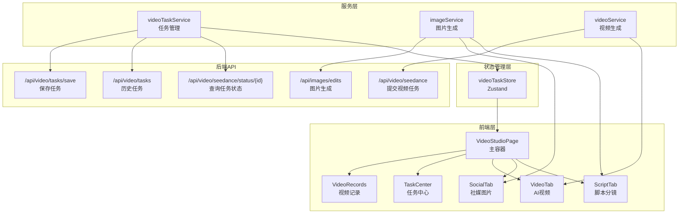

## 1. 架构设计



## 2. 技术栈

- **前端**：React 18 + TypeScript + Tailwind CSS 3 + Vite
- **状态管理**：Zustand（管理视频任务全局状态，跨页面持久化）
- **路由**：react-router-dom v6（现有项目已集成）
- **动画**：framer-motion（现有项目已集成）
- **图标**：lucide-react（现有项目已集成）
- **后端**：使用现有后端API，无需新增

## 3. 路由定义

| 路由 | 用途 |
|------|------|
| `/video` | 视频工作室主页面（替换现有VideoProjectPage） |

## 4. API 定义

### 4.1 现有API（复用）

```typescript
// 提交视频生成任务
POST /api/video/seedance
Body: { prompt: string, image?: string, endImage?: string, duration?: number }
Response: { success: boolean, taskIds: string[] }

// 查询任务状态
GET /api/video/seedance/status/{taskId}
Response: { 
  status: 'pending' | 'processing' | 'completed' | 'succeeded' | 'failed',
  progress: number,
  url?: string,
  error?: string 
}

// 获取历史任务
GET /api/video/tasks
Response: { success: boolean, tasks: VideoTask[] }

// 保存任务
POST /api/video/tasks/save
Body: { taskId: string, status: string, url?: string, thumbnail?: string, prompt?: string }
Response: { success: boolean }

// 图片生成
POST /api/images/edits
Body: FormData (image + prompt + options)
Response: { success: boolean, image: string }
```

### 4.2 数据类型定义

```typescript
// 视频任务
interface VideoTask {
  taskId: string;
  status: 'pending' | 'processing' | 'completed' | 'succeeded' | 'failed';
  progress: number;
  url?: string;
  thumbnail?: string;
  prompt?: string;
  createdAt: number;
  updatedAt: number;
  mode?: 'text' | 'image' | 'first-last-frame';
}

// 脚本分镜任务
interface ScriptTask {
  id: string;
  type: 'tk-video' | 'storyboard';
  productImages: string[];
  templateId?: string;
  language: string;
  script?: string;
  shots: ScriptShot[];
  resultImage?: string;
  status: 'idle' | 'analyzing' | 'generating' | 'done' | 'error';
}

// 社媒图片任务
interface SocialTask {
  id: string;
  type: 'xiaohongshu' | 'social-pov';
  productImages: string[];
  language: string;
  analysis?: string;
  generatedImages: string[];
  status: 'idle' | 'analyzing' | 'generating' | 'done' | 'error';
}
```

## 5. 状态管理设计（Zustand Store）

```typescript
// videoTaskStore.ts
interface VideoTaskStore {
  // 视频任务
  tasks: Map<string, VideoTask>;
  activeTaskId: string | null;
  
  // 任务操作
  addTask: (task: VideoTask) => void;
  updateTask: (taskId: string, update: Partial<VideoTask>) => void;
  removeTask: (taskId: string) => void;
  setActiveTask: (taskId: string | null) => void;
  
  // 轮询管理
  pollingTimers: Map<string, ReturnType<typeof setInterval>>;
  startPolling: (taskId: string) => void;
  stopPolling: (taskId: string) => void;
  stopAllPolling: () => void;
  
  // 任务恢复（页面加载时）
  restoreTasks: () => Promise<void>;
  
  // 视频记录
  completedVideos: VideoTask[];
  loadCompletedVideos: () => Promise<void>;
}
```

## 6. 核心组件结构

```
src/pages/video/
├── VideoStudioPage.tsx          # 主容器页面（替换VideoProjectPage）
├── components/
│   ├── StudioNav.tsx            # 顶部导航栏
│   ├── StudioStatusBar.tsx      # 底部状态栏
│   ├── TaskCenterDrawer.tsx     # 任务中心抽屉
│   ├── TaskCard.tsx             # 单个任务卡片
│   ├── VideoRecordGrid.tsx      # 视频记录网格
│   ├── VideoPreviewModal.tsx    # 视频预览弹窗
│   └── UploadZone.tsx           # 通用上传组件
├── tabs/
│   ├── ScriptTab.tsx            # 脚本分镜Tab（整合TK+故事板）
│   ├── SocialTab.tsx            # 社媒图片Tab（整合小红书+POV）
│   └── VideoTab.tsx             # AI视频Tab（核心功能）
├── hooks/
│   ├── useVideoTasks.ts         # 视频任务管理hook
│   └── useImageUpload.ts        # 图片上传hook
└── store/
    └── videoTaskStore.ts        # Zustand全局状态
```

## 7. 关键技术实现

### 7.1 task_id 异步任务机制

- 提交视频生成后获取 task_id，存入 Zustand store
- 使用 `setInterval` 每3秒轮询 `/api/video/seedance/status/{taskId}`
- 轮询定时器存入 store 的 `pollingTimers` Map
- 任务完成/失败后自动停止轮询
- 页面组件卸载时不停止轮询（支持后台生成）
- 使用 `visibilitychange` 事件：页面隐藏时降低轮询频率（10秒），恢复时加快（3秒）

### 7.2 后台生成保障

- 轮询状态存入 Zustand store（非组件 state），组件卸载不影响
- 页面加载时调用 `restoreTasks()` 从服务端恢复未完成任务并重启轮询
- 使用 `beforeunload` 事件提醒用户有任务进行中
- 任务完成时通过浏览器 Notification API 推送通知（需用户授权）

### 7.3 视频保存记录

- 已完成视频存入 Zustand store 的 `completedVideos`
- 同时保存到服务端 (`/api/video/tasks/save`)
- 支持按时间排序、筛选状态
- 提供预览（弹窗播放）、下载、复制链接功能

### 7.4 错误处理

- 网络错误：自动重试3次，指数退避
- 任务失败：显示错误信息，提供「重试」按钮
- 积分不足：提前检查，不足时弹出充值引导
- 上传失败：支持断点续传（图片小文件可忽略）
