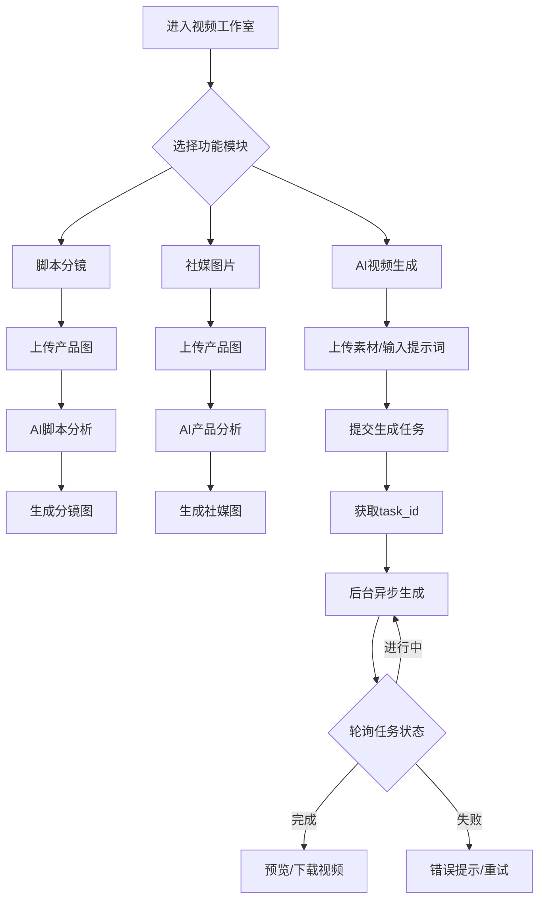

## 1. 产品概述

Softhooky Video Studio 是一个以视频生成为核心的独立创作工作台，为电商/社媒内容创作者提供从「脚本分镜图」到「社媒图片」再到「AI视频」的完整内容生产流水线。页面设计彻底打破传统侧边栏布局，采用沉浸式「剧院风格」全屏设计，以视频作为视觉核心，营造电影级创作氛围。

- 目标用户：跨境电商卖家、社媒内容创作者、短视频制作者
- 核心价值：一站式完成「分镜脚本 → 社媒配图 → AI视频」的完整创作链路

## 2. 核心功能

### 2.1 用户角色
| 角色 | 注册方式 | 核心权限 |
|------|---------|---------|
| 普通用户 | 邮箱注册/第三方登录 | 使用所有创作功能，受积分限制 |
| 子账号 | 主账号创建 | 继承主账号权限 |

### 2.2 功能模块

1. **脚本分镜图生成**：上传产品图 → AI脚本分析 → 生成视频分镜合成图（TK脚本图 + 故事板）
2. **社媒图片生成**：上传产品图 → AI分析 → 生成多平台社媒配图（小红书 + 社媒POV）
3. **AI视频生成**（核心）：支持Veo 3.1视频生成，含参考图/首尾帧模式，task_id异步任务，后台持续生成

### 2.3 页面详情

| 页面/模块 | 功能说明 |
|-----------|---------|
| 视频工作室主页面 | 全屏沉浸式布局，顶部Tab切换三大功能模块，中央为工作区 |
| 脚本分镜模块 | 复用TikTokVideoPage和StoryboardPage的核心逻辑，新UI包装 |
| 社媒图片模块 | 复用XiaohongshuPage和SocialMediaPage的核心逻辑，新UI包装 |
| 视频生成模块 | 复用Veo31VideoPage的核心逻辑，增加task_id任务中心和视频记录 |
| 任务中心面板 | 侧拉抽屉，展示所有进行中/已完成/失败的视频生成任务 |
| 视频记录库 | 网格展示已生成视频，支持预览、下载、分享 |

## 3. 核心流程

用户进入视频工作室 → 选择功能模块（脚本/社媒/视频） → 上传素材 → AI处理 → 查看结果 → 保存/下载

对于视频生成的特殊流程：
用户上传素材 → 提交视频生成 → 获取task_id → 任务进入后台队列 → 用户可离开页面 → 回来后任务中心显示进度 → 视频完成后通知



## 4. 用户界面设计

### 4.1 设计风格 —— 「暗夜剧院」

- **主题**：深邃暗黑背景 + 荧光蓝/紫渐变高亮，营造剧院级沉浸感
- **布局**：打破传统侧边栏，采用「舞台式」全屏布局
  - 顶部：极细导航栏 + 功能模块切换（胶囊Tab）
  - 中央：大面积工作区，类似剪辑软件的时间线风格
  - 右侧：可收起的任务中心抽屉（悬浮按钮触发）
  - 底部：状态栏（积分余额、任务状态摘要）
- **字体**：标题用 `Space Grotesk`（几何感强），正文用 `DM Sans`（清晰现代），中文回退 `Noto Sans SC`
- **配色**：
  - 背景：`#0A0A0F`（极深蓝黑）
  - 表面：`#12121A`（卡片/面板）
  - 主色：`#6366F1` → `#8B5CF6`（靛蓝-紫渐变）
  - 强调：`#22D3EE`（荧光青，用于按钮/进度条）
  - 成功：`#10B981`
  - 错误：`#EF4444`
  - 文字：`#E2E8F0`（主文字）/ `#64748B`（次要文字）
- **动效**：卡片悬浮微升起 + 柔光阴影，进度条脉冲动画，页面切换淡入滑动
- **圆角**：大圆角（16px-24px），卡片和按钮均采用圆润风格

### 4.2 页面布局概述

**主页面结构**：
```
┌─────────────────────────────────────────────────────┐
│ Logo  [脚本分镜] [社媒图片] [AI视频]    积分 任务中心 │  ← 顶部导航（48px）
├─────────────────────────────────────────────────────┤
│                                                     │
│            ┌─────────────────────────┐              │
│            │     工作区内容区域       │              │
│            │   （根据Tab切换内容）     │              │
│            │                         │              │
│            └─────────────────────────┘              │
│                                                     │
├─────────────────────────────────────────────────────┤
│ 状态栏：积分余额 | 进行中任务数 | 版本               │  ← 底部状态栏（32px）
└─────────────────────────────────────────────────────┘
```

**任务中心抽屉**（从右侧滑出）：
```
┌──────────────────────┐
│ 任务中心     [全部] [进行中] [已完成] │
├──────────────────────┤
│ 🎬 视频任务1  67%    │
│    ████████░░░  预计2分钟 │
│                      │
│ 🎬 视频任务2  完成 ✓  │
│    [预览] [下载]      │
│                      │
│ 🎬 视频任务3  失败 ✗  │
│    [重试]             │
└──────────────────────┘
```

### 4.3 响应式设计
- 桌面优先（1280px+）
- 平板适配（768px-1279px）：工作区缩小，任务中心改为全屏覆盖
- 移动端（<768px）：跳转至现有的 /mobile 页面

### 4.4 核心交互
- 任务中心：悬浮按钮（右下角）显示进行中任务数徽标，点击展开抽屉
- 视频生成中：工作区内显示实时进度卡片，含预估剩余时间
- 视频完成：Toast通知 + 任务中心徽标闪烁
- 文件上传：拖拽区域 + 粘贴支持，上传时显示进度环
